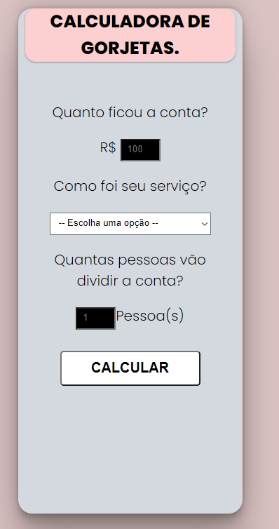
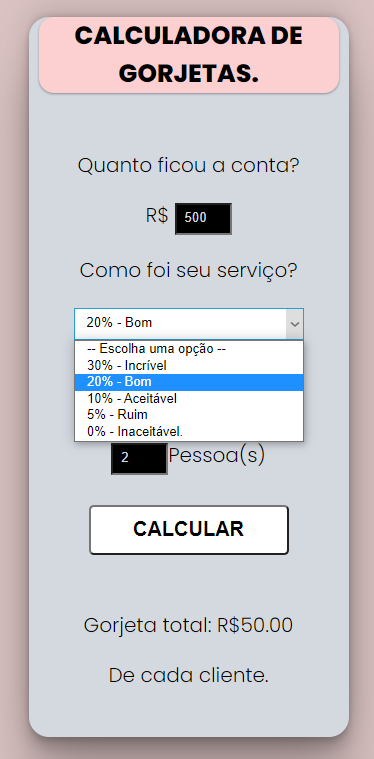
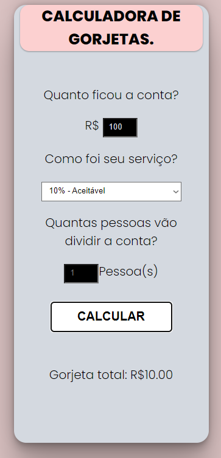

<body>
    <h1 align="center">Calculadora de gorjeta  </h1> 
<h2 align="center">Pagina web, responsiva, criada com: CSS, HTML e JavaScritp</h2>
 

<h3>Praticando estrutura do HTML, manipulação de padding, border e margin. Responsividade e eventos de mouse como click e hover, tratamento de exceções e calculos lógicos passando dados do HTML para o JavaScript.<h3>

<h3>Para acessar à página,  <a href="https://kleitonmq.github.io/Calculagorjeta/">clique aqui.</a></h3>
 
<h4 align="center">Screenshots.</h4>

</body>
